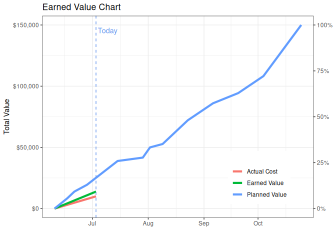

<!-- README.md is generated from README.Rmd. Please edit that file -->

# pmev

<!-- badges: start -->

[](https://lifecycle.r-lib.org/articles/stages.html#experimental)
[](https://CRAN.R-project.org/package=pmev)
<!-- badges: end -->

The goal of pmev is to implement project management tracking metrics as
outlined in the Project Management Body of Knowledge (PMBOK) manual
which can be found .

## Installation

You can install the development version of `pmev` using either:

``` r
# install.packages("pmev")
# Or the development version at
# install.packages("devtools")
# devtools::install_github("david-hammond/pmev")
```

## Example

``` r
library(pmev)
data(project)
earnedvalue <- ev$new(start = project$start,
                       end = project$end,
                       progress = project$progress,
                       planned_cost = project$planned_cost,
                       project_value = 150000,
                       cost_to_date = 10000,
                       date = "2024-07-03")
print(earnedvalue$earned_value)
#>         date total_value budget_at_completion project_complete
#> 1 2024-07-03      150000                47934             0.09
#>   schedule_complete planned_value earned_value actual_cost schedule_variance
#> 1             -0.08       25144.5     13878.46       10000         -11266.04
#>   cost_variance cost_performance_index estimate_at_completion
#> 1       3878.46                   1.39               108081.2
#>   estimate_to_complete variance_at_completion to_complete_performance_index
#> 1             98081.17              -60147.17                          0.97
```

The Earned Value can then be plotted in the following way.

``` r
plot(earnedvalue)
```


